# Design Document

## Overview

GramAI Advisor is designed as a cloud-native, microservices-based platform that provides comprehensive agricultural advisory services to Indian farmers. The system emphasizes simplicity, multilingual support, and offline-first capabilities to serve rural users with limited connectivity and literacy. The architecture leverages public APIs and open-source technologies while maintaining extensibility for future AWS service integration.

The platform follows a domain-driven design approach with clear separation of concerns across agricultural advisory, market intelligence, financial services, and user experience domains. Each service is designed to operate independently while contributing to a cohesive user experience through event-driven orchestration.

## Architecture

### High-Level Architecture

```mermaid
graph TB
    subgraph "Client Layer"
        WEB[Web Interface]
        MOBILE[Mobile App]
        VOICE[Voice Interface]
    end
    
    subgraph "API Gateway Layer"
        GATEWAY[API Gateway]
        AUTH[Authentication Service]
        RATE[Rate Limiter]
    end
    
    subgraph "Core Services"
        PROFILE[Profile Service]
        ADVISORY[Advisory Engine]
        MARKET[Market Intelligence]
        FINANCE[Finance Service]
        SCHEME[Scheme Discovery]
        VISUAL[Visual Analysis]
        SOIL[Soil Analysis]
        DOCS[Document Service]
    end
    
    subgraph "AI/ML Layer"
        NLP[NLP Service]
        SPEECH[Speech Service]
        VISION[Computer Vision]
        RECOMMEND[Recommendation Engine]
    end
    
    subgraph "Data Layer"
        CACHE[Redis Cache]
        DB[(PostgreSQL)]
        FILES[File Storage]
        SEARCH[Elasticsearch]
    end
    
    subgraph "External APIs"
        IMD[IMD Weather]
        ENAM[e-NAM]
        AGMARK[AGMARKNET]
        SCHEMES[Govt Schemes]
    end
    
    WEB --> GATEWAY
    MOBILE --> GATEWAY
    VOICE --> GATEWAY
    
    GATEWAY --> AUTH
    GATEWAY --> RATE
    GATEWAY --> PROFILE
    GATEWAY --> ADVISORY
    GATEWAY --> MARKET
    GATEWAY --> FINANCE
    GATEWAY --> SCHEME
    GATEWAY --> VISUAL
    GATEWAY --> SOIL
    GATEWAY --> DOCS
    
    ADVISORY --> NLP
    ADVISORY --> RECOMMEND
    VISUAL --> VISION
    PROFILE --> SPEECH
    
    PROFILE --> DB
    ADVISORY --> DB
    MARKET --> CACHE
    FINANCE --> DB
    SCHEME --> SEARCH
    VISUAL --> FILES
    SOIL --> FILES
    DOCS --> FILES
    
    MARKET --> IMD
    MARKET --> ENAM
    MARKET --> AGMARK
    SCHEME --> SCHEMES
```



### Service Architecture Patterns

**Event-Driven Architecture**: Services communicate through asynchronous events using a message broker (Apache Kafka) to ensure loose coupling and resilience.

**CQRS Pattern**: Separate read and write models for complex domains like advisory recommendations and market intelligence to optimize for different access patterns.

**Circuit Breaker Pattern**: Implement circuit breakers for external API calls to handle failures gracefully and maintain system stability.

**Saga Pattern**: Manage distributed transactions across services, particularly for complex workflows like loan applications and scheme registrations.

## Components and Interfaces

### 1. API Gateway Service

**Responsibilities:**
- Request routing and load balancing
- Authentication and authorization
- Rate limiting and throttling
- Request/response transformation
- API versioning and documentation

**Key Interfaces:**
```typescript
interface APIGatewayConfig {
  routes: RouteConfig[];
  rateLimits: RateLimitConfig[];
  authProviders: AuthProvider[];
  transformations: TransformationRule[];
}

interface RouteConfig {
  path: string;
  method: HttpMethod;
  targetService: string;
  authRequired: boolean;
  rateLimit?: string;
}
```

### 2. Profile Service

**Responsibilities:**
- Farmer profile management
- Location and land data storage
- Preference management
- Profile-based personalization

**Key Interfaces:**
```typescript
interface FarmerProfile {
  id: string;
  personalInfo: PersonalInfo;
  location: LocationData;
  landDetails: LandDetails;
  preferences: FarmingPreferences;
  riskTolerance: RiskLevel;
  createdAt: Date;
  updatedAt: Date;
}

interface LocationData {
  state: string;
  district: string;
  block: string;
  village?: string;
  coordinates?: GeoCoordinates;
}

interface LandDetails {
  totalArea: number;
  irrigatedArea: number;
  waterSources: WaterSource[];
  soilType?: string;
  currentCrops: CropInfo[];
}
```

### 3. Multilingual NLP Service

**Responsibilities:**
- Language detection and translation
- Text processing and understanding
- Intent recognition and entity extraction
- Response generation in local languages

**Key Interfaces:**
```typescript
interface NLPService {
  detectLanguage(text: string): Promise<LanguageCode>;
  translateText(text: string, targetLang: LanguageCode): Promise<string>;
  extractIntent(text: string, context: UserContext): Promise<Intent>;
  generateResponse(intent: Intent, data: any, lang: LanguageCode): Promise<string>;
}

interface Intent {
  type: IntentType;
  entities: Entity[];
  confidence: number;
  context: ConversationContext;
}
```

### 4. Speech Service

**Responsibilities:**
- Speech-to-text conversion for Indian languages
- Text-to-speech synthesis
- Audio quality assessment
- Voice command processing

**Key Interfaces:**
```typescript
interface SpeechService {
  speechToText(audioData: Buffer, language: LanguageCode): Promise<TranscriptionResult>;
  textToSpeech(text: string, language: LanguageCode, voice?: VoiceConfig): Promise<AudioBuffer>;
  detectAudioQuality(audioData: Buffer): Promise<QualityMetrics>;
}

interface TranscriptionResult {
  text: string;
  confidence: number;
  language: LanguageCode;
  alternatives?: string[];
}
```

### 5. Advisory Engine

**Responsibilities:**
- Crop recommendation based on multiple factors
- Integrated farming advice
- Seasonal planning and calendar generation
- Sustainable practice recommendations

**Key Interfaces:**
```typescript
interface AdvisoryEngine {
  getCropRecommendations(profile: FarmerProfile, season: Season): Promise<CropRecommendation[]>;
  generateLandAllocation(profile: FarmerProfile, preferences: AllocationPreferences): Promise<LandAllocation>;
  getSeasonalCalendar(crops: string[], location: LocationData): Promise<SeasonalCalendar>;
  getPestDiseaseAdvice(symptoms: string[], cropType: string): Promise<TreatmentAdvice>;
}

interface CropRecommendation {
  cropName: string;
  suitabilityScore: number;
  expectedYield: YieldEstimate;
  inputRequirements: InputRequirements;
  marketDemand: MarketDemandInfo;
  riskFactors: RiskFactor[];
  explanation: string;
}
```

### 6. Visual Analysis Engine

**Responsibilities:**
- Land photo and video analysis
- Area estimation from visual inputs
- Terrain classification and zone identification
- Visual quality assessment

**Key Interfaces:**
```typescript
interface VisualAnalysisEngine {
  analyzeLandPhoto(imageData: Buffer, metadata: ImageMetadata): Promise<LandAnalysis>;
  estimateArea(imageData: Buffer, referenceObjects?: ReferenceObject[]): Promise<AreaEstimate>;
  classifyTerrain(imageData: Buffer): Promise<TerrainClassification>;
  assessImageQuality(imageData: Buffer): Promise<QualityAssessment>;
}

interface LandAnalysis {
  estimatedArea: number;
  terrainType: TerrainType;
  zones: LandZone[];
  soilVisualIndicators: SoilIndicator[];
  vegetationCover: VegetationAnalysis;
  recommendations: string[];
}
```

### 7. Market Intelligence Service

**Responsibilities:**
- Real-time price data aggregation
- Market trend analysis
- Transport cost calculation
- Optimal selling time prediction

**Key Interfaces:**
```typescript
interface MarketIntelligenceService {
  getCurrentPrices(commodity: string, location: LocationData): Promise<PriceData[]>;
  getMarketTrends(commodity: string, timeframe: TimeFrame): Promise<TrendAnalysis>;
  calculateTransportCosts(origin: LocationData, destinations: LocationData[]): Promise<TransportCost[]>;
  predictOptimalSellingTime(commodity: string, quantity: number): Promise<SellingRecommendation>;
}

interface PriceData {
  market: MarketInfo;
  commodity: string;
  price: number;
  unit: string;
  date: Date;
  quality: QualityGrade;
  volume: number;
}
```

### 8. Scheme Discovery Engine

**Responsibilities:**
- Government scheme database management
- Eligibility assessment
- Application process guidance
- Scheme recommendation based on profile

**Key Interfaces:**
```typescript
interface SchemeDiscoveryEngine {
  findEligibleSchemes(profile: FarmerProfile): Promise<SchemeRecommendation[]>;
  getSchemeDetails(schemeId: string): Promise<SchemeDetails>;
  assessEligibility(schemeId: string, profile: FarmerProfile): Promise<EligibilityResult>;
  generateApplicationGuidance(schemeId: string): Promise<ApplicationGuide>;
}

interface SchemeRecommendation {
  scheme: SchemeDetails;
  eligibilityScore: number;
  potentialBenefit: BenefitEstimate;
  applicationComplexity: ComplexityLevel;
  deadline?: Date;
  explanation: string;
}
```

### 9. Finance Enablement Service

**Responsibilities:**
- Loan eligibility assessment
- Project report generation
- Financial institution integration
- Application tracking

**Key Interfaces:**
```typescript
interface FinanceService {
  assessLoanEligibility(profile: FarmerProfile, loanAmount: number): Promise<EligibilityAssessment>;
  generateProjectReport(projectDetails: ProjectDetails): Promise<ProjectReport>;
  findSuitableLenders(requirements: LoanRequirements): Promise<LenderRecommendation[]>;
  trackApplication(applicationId: string): Promise<ApplicationStatus>;
}

interface ProjectReport {
  projectSummary: ProjectSummary;
  costEstimation: CostBreakdown;
  revenueProjection: RevenueProjection;
  riskAssessment: RiskAssessment;
  repaymentSchedule: RepaymentPlan;
  documents: RequiredDocument[];
}
```

### 10. Document Processing Service

**Responsibilities:**
- Document upload and storage
- OCR and text extraction
- Document quality assessment
- KYC document validation

**Key Interfaces:**
```typescript
interface DocumentService {
  uploadDocument(file: FileUpload, documentType: DocumentType): Promise<DocumentRecord>;
  extractText(documentId: string): Promise<ExtractedText>;
  validateDocument(documentId: string, validationRules: ValidationRule[]): Promise<ValidationResult>;
  assessQuality(documentId: string): Promise<QualityReport>;
}

interface DocumentRecord {
  id: string;
  type: DocumentType;
  filename: string;
  size: number;
  uploadDate: Date;
  extractedData?: ExtractedData;
  validationStatus: ValidationStatus;
}
```

## Data Models

### Core Domain Models

```typescript
// Farmer and Profile Models
interface FarmerProfile {
  id: string;
  personalInfo: {
    name: string;
    age: number;
    gender: Gender;
    education: EducationLevel;
    experience: number; // years in farming
    primaryLanguage: LanguageCode;
    phoneNumber: string;
    alternateContact?: string;
  };
  location: {
    state: string;
    district: string;
    block: string;
    village?: string;
    pincode: string;
    coordinates?: {
      latitude: number;
      longitude: number;
    };
  };
  landDetails: {
    totalArea: number; // in acres
    ownedArea: number;
    leasedArea: number;
    irrigatedArea: number;
    soilTypes: SoilType[];
    waterSources: WaterSource[];
    currentCrops: CurrentCrop[];
    infrastructure: FarmInfrastructure[];
  };
  financialProfile: {
    annualIncome: IncomeRange;
    capitalAvailable: number;
    creditScore?: number;
    bankAccounts: BankAccount[];
    existingLoans: LoanInfo[];
    riskTolerance: RiskLevel;
  };
  preferences: {
    cropsOfInterest: string[];
    farmingMethods: FarmingMethod[];
    integratedFarming: boolean;
    organicFarming: boolean;
    technologyAdoption: TechAdoptionLevel;
    marketPreferences: MarketPreference[];
  };
  metadata: {
    createdAt: Date;
    updatedAt: Date;
    lastActiveAt: Date;
    profileCompleteness: number; // percentage
    verificationStatus: VerificationStatus;
  };
}

// Agricultural Models
interface CropRecommendation {
  cropId: string;
  cropName: string;
  localName: string;
  variety?: string;
  suitabilityScore: number; // 0-100
  seasonality: {
    sowingPeriod: DateRange;
    harvestPeriod: DateRange;
    duration: number; // days
  };
  requirements: {
    soilType: SoilType[];
    waterRequirement: WaterRequirement;
    climateConditions: ClimateCondition[];
    inputCosts: CostBreakdown;
    laborRequirement: LaborRequirement;
  };
  projections: {
    expectedYield: YieldRange;
    marketPrice: PriceRange;
    profitability: ProfitabilityMetrics;
    riskFactors: RiskFactor[];
  };
  guidance: {
    bestPractices: string[];
    commonChallenges: Challenge[];
    expertTips: string[];
    resourceLinks: ResourceLink[];
  };
}

interface LandAllocation {
  totalArea: number;
  allocations: {
    activity: ActivityType;
    area: number;
    percentage: number;
    expectedIncome: IncomeProjection;
    riskLevel: RiskLevel;
    reasoning: string;
  }[];
  seasonalPlan: SeasonalAllocation[];
  totalProjectedIncome: IncomeProjection;
  diversificationScore: number;
  sustainabilityScore: number;
}

// Market and Financial Models
interface MarketData {
  commodity: string;
  market: {
    name: string;
    location: LocationData;
    type: MarketType;
    distance: number; // km from farmer
  };
  pricing: {
    currentPrice: number;
    unit: string;
    priceRange: PriceRange;
    lastUpdated: Date;
    trend: PriceTrend;
    historicalData: PricePoint[];
  };
  logistics: {
    transportCost: number;
    handlingCharges: number;
    marketFees: number;
    netPrice: number;
  };
  marketConditions: {
    demand: DemandLevel;
    supply: SupplyLevel;
    quality: QualityRequirement[];
    seasonalFactors: SeasonalFactor[];
  };
}

interface SchemeDetails {
  id: string;
  name: string;
  localName?: string;
  category: SchemeCategory;
  level: GovernmentLevel; // central, state, district
  description: string;
  objectives: string[];
  benefits: {
    type: BenefitType;
    amount?: number;
    percentage?: number;
    description: string;
  }[];
  eligibility: {
    criteria: EligibilityCriteria[];
    documents: RequiredDocument[];
    restrictions: Restriction[];
  };
  application: {
    process: ApplicationStep[];
    timeline: string;
    fees?: number;
    deadlines: ImportantDate[];
  };
  implementation: {
    nodal_agency: string;
    contact_details: ContactInfo;
    helpline?: string;
    website?: string;
  };
  metadata: {
    lastUpdated: Date;
    status: SchemeStatus;
    successRate?: number;
    averageProcessingTime?: number;
  };
}
```

### Data Storage Strategy

**PostgreSQL (Primary Database):**
- Farmer profiles and authentication data
- Scheme information and eligibility rules
- Financial records and loan applications
- Audit logs and compliance data

**Redis (Caching Layer):**
- Market price data and trends
- Weather information
- Frequently accessed recommendations
- Session data and temporary calculations

**Elasticsearch (Search Engine):**
- Scheme discovery and full-text search
- Advisory content and knowledge base
- Market intelligence and trend analysis
- Document content indexing

**File Storage (MinIO/S3-compatible):**
- Land photos and visual analysis data
- Soil reports and documents
- Audio files for speech processing
- Generated reports and certificates

## Correctness Properties

*A property is a characteristic or behavior that should hold true across all valid executions of a system—essentially, a formal statement about what the system should do. Properties serve as the bridge between human-readable specifications and machine-verifiable correctness guarantees.*

Let me analyze the acceptance criteria to determine which ones can be tested as properties.

<function_calls>
<invoke name="prework">
<parameter name="featureName">gramai-advisor